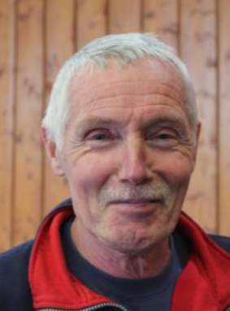
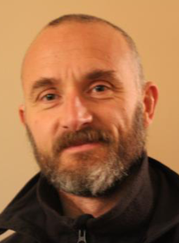

```{r setup, include=FALSE}
WORDS_TO_IGNORE <- c("guideascbalan", "ly")
source("knitr-options.R")
source("spelling-check.R")
```

# Introduction {-}

Bienvenue sur ce **guide du coureur**, un site conçu pour les membres de notre club de course, l'ASC Balan, quel que soit leur niveau ou leur expérience.
Ce guide vous aidera à comprendre les différents types d'entraînements, et comment progresser efficacement tout en minimisant les risques de blessures.

Le nouveau site de notre club se trouve [ici](https://balan-running.fr/).

Que vous vous entraîniez pour un 5 km, un 10 km, un semi-marathon, un marathon, un 24 heures, ou un trail, 
vous trouverez ici les principes fondamentaux et des conseils pratiques pour atteindre vos objectifs.

L'objectif est d'apprendre à structurer vos séances de manière intelligente,
en fonction de vos capacités et de vos ambitions, afin d'améliorer vos performances en course à pied.


## Mes performances {-}

Pour donner un exemple concret, voici mes progrès depuis que je suis au club :

```{r, include=FALSE}
library(dplyr)
tests_VMA <- tibble::tribble(
  ~date,      ~vitesse, 
  "02/10/25", 17.77,
  "07/12/24", 17.5,
  "08/10/24", 17.27,
  "18/10/22", 16.0
) %>% 
  mutate(course = "Test VMA") %>% 
  print()

semis <- tibble::tribble(
  ~ville,  ~date,      ~chrono,
  "Annecy", "15/04/23", "1:43:53",
  "Dole", "13/10/24", "1:31:58",
  "Dole", "12/10/25", "1:27:36",
  "Bourg-en-Bresse", "03/03/24", "1:37:45",
  "Bourg-en-Bresse", "02/03/25", "1:29:10"
) %>% 
  mutate(course = "Semi-marathon", dist = 21.1) %>% 
  print()

`10K` <- tibble::tribble(
  ~ville,      ~date,      ~chrono,
  "Troyes",     "11/05/25", "40:54",
  "Bletterans", "23/03/25", "40:44"
) %>% 
  mutate(course = "10 km", dist = 10) %>% 
  print()

DHL5K <- tibble::tribble(
  ~date,      ~chrono,
  "24/08/23", "21:44",
  "22/08/24", "20:40",
  "21/08/25", "19:06"
) %>% 
  mutate(course = "5K DHL Aarhus", dist = 5) %>% 
  print()

parse_chrono <- function(x) {
  x2 <- ifelse(grepl("^\\d{1,2}:\\d{2}$", x), paste0("00:", x), x)
  lubridate::hms(x2) / lubridate::hours(1)
}

all <- bind_rows(tests_VMA, semis, `10K`, DHL5K) %>% 
  mutate(date = lubridate::dmy(date),
         vitesse = ifelse(!is.na(vitesse), vitesse, 
                          dist / parse_chrono(chrono))) %>% 
  print()
```


```{r, echo=FALSE, out.width="90%"}
library(ggplot2)
ggplot(all, aes(date, vitesse, color = course, label = ville)) +
  theme_bw(14) + 
  geom_point(size = 3) + 
  geom_line(linewidth = 1) +
  # geom_smooth() +
  scale_y_continuous(breaks = 1:25, minor_breaks = seq(1, 25, by = 0.2)) +
  scale_x_date(breaks = lubridate::dmy(paste0("01/09/", 22:30)),
               limits = c(lubridate::dmy("01/09/22"), lubridate::today()),
               sec.axis = dup_axis(
                 breaks = as.Date("1993-03-21") + lubridate::years(30:100),
                 labels = 30:100,
                 name = "age"
               )) +
  theme(legend.position = "bottom",
        legend.text = element_text(margin = margin(l = 3, r = 6, unit = "pt")),
        panel.grid.major = element_line(color = "grey50", size = 0.6),
        panel.grid.minor = element_line(color = "gray70", size = 0.2),
        plot.margin = margin(t = 5, r = 30, b = 5, l = 5),
        legend.key.width = unit(1, "cm"))
```


## Les entraîneurs {-}

Nous avons quatre entraîneurs au club :

<table style="table-layout: fixed; width: 100%;">
<thead>
<tr>
<th style="text-align: center; width: 25%;">Jean-Jacques</th>
<th style="text-align: center; width: 25%;">Lionel</th>
<th style="text-align: center; width: 25%;">Laurent</th>
<th style="text-align: center; width: 25%;">Frédéric</th>
</tr>
</thead>
<tbody>
<tr>
<td style="vertical-align: top; padding: 5px;">

</td>
<td style="vertical-align: top; padding: 5px;">

</td>
<td style="vertical-align: top; padding: 5px;">

</td>
<td style="vertical-align: top; padding: 5px;">

</td>
</tr>
</tbody>
</table>

**N'hésitez pas à demander des conseils et des plans d'entraînement personnalisés aux entraîneurs.**

Vincent et moi (Florian) sommes en cours de formation.


## Remerciements {-}

Merci aux entraîneurs pour leurs réponses à mes questions et leurs retours sur ce guide.
Merci aussi à Vincent, Sylvie, Sébastien, Mélanie et Cécile. 
