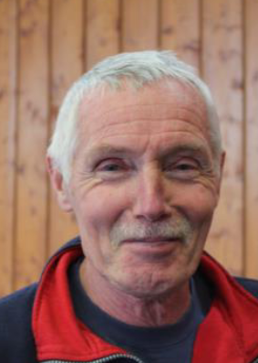
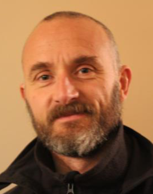
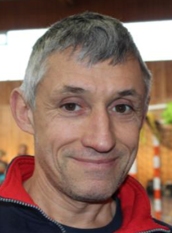

--- 
title: "Le Guide du Coureur de l'ASC Balan"
author: "Par Florian et les entraîneurs"
date: "Mis à jour le `r { Sys.setlocale('LC_TIME', 'fr_FR'); format(Sys.Date(), format='%d %B %Y') }`"
site: bookdown::bookdown_site
documentclass: book
bibliography: [book.bib]
biblio-style: apalike
link-citations: yes
# description: ""
# twitter-handle: ""
# github-repo: ""
url: 'https\://privefl.github.io/guideascbalan/'
# cover-image: "images/hexsticker.png"
---

```{r setup, include=FALSE}
source("knitr-options.R")
source("spelling-check.R")
```

# Introduction {-}

Bienvenue sur ce **guide du coureur**, un site conçu pour les membres de notre club de course, quel que soit leur niveau ou leur expérience.
Ce guide vous aidera à comprendre les différents types d'entraînements, et comment progresser efficacement tout en minimisant les risques de blessures.

Que vous vous entraîniez pour un 10 km, un semi-marathon ou un marathon,
vous trouverez ici les principes fondamentaux et des conseils pratiques pour atteindre vos objectifs.

L'objectif est d'apprendre à structurer vos séances de manière intelligente,
en fonction de vos capacités et de vos ambitions, afin d'améliorer vos performances en course à pied.


## Les entraîneurs {-}

**N'hésitez pas à demander des conseils et des plans d'entraînement personnalisés aux entraîneurs.**

Nous avons 4 entraîneurs au club :

Jean-Jacques            |  Lionel                   | Laurent     |  Frédéric
:-------------------------:|:-------------------------:|:-------------------------:|:-------------------------:
 |  |  | 

