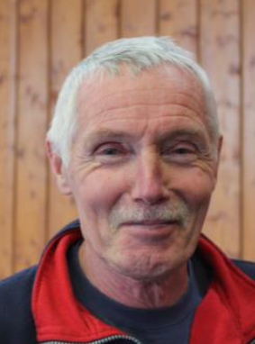
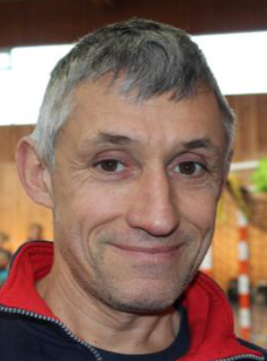

```{r setup, include=FALSE}
WORDS_TO_IGNORE <- c("guideascbalan", "ly")
source("knitr-options.R")
source("spelling-check.R")
```

# Introduction {-}

Bienvenue sur ce **guide du coureur**, un site conçu pour les membres de notre club de course, l'ASC Balan, quel que soit leur niveau ou leur expérience.
Ce guide vous aidera à comprendre les différents types d'entraînements, et comment progresser efficacement tout en minimisant les risques de blessures.

Le nouveau site de notre club se trouve [ici](https://balan-running.fr/).

Que vous vous entraîniez pour un 5 km, un 10 km, un semi-marathon, un marathon, un 24 heures, ou un trail, 
vous trouverez ici les principes fondamentaux et des conseils pratiques pour atteindre vos objectifs.

L'objectif est d'apprendre à structurer vos séances de manière intelligente,
en fonction de vos capacités et de vos ambitions, afin d'améliorer vos performances en course à pied.


## Mes performances {-}

Pour donner un exemple concret, voici mes progrès depuis que je suis au club :

```{r, include=FALSE}
library(dplyr)
library(lubridate)

tests_VMA <- tibble::tribble(
  ~date,      ~vitesse, 
  "24/09/26", 18.5,
  "02/10/25", 17.77,
  "07/12/24", 17.5,
  "08/10/24", 17.27,
  "18/10/22", 16.0
) %>% 
  mutate(course = "Test VMA") %>% 
  print()

marathons <- tibble::tribble(
  ~ville,  ~date,      ~chrono,
  # "Vercors", "27/06/26", "3:26:00"
) %>% 
  mutate(course = "Marathon", dist = 42.2) %>% 
  print()

semis <- tibble::tribble(
  ~ville,  ~date,      ~chrono,
  "Annecy", "15/04/23", "1:43:53",
  "Dole", "13/10/24", "1:31:58",
  "Dole", "12/10/25", "1:27:36",
  "Bourg-en-Bresse", "03/03/24", "1:37:45",
  "Bourg-en-Bresse", "02/03/25", "1:29:10",
  "Bourg-en-Bresse", "01/03/26", "1:23:48"
) %>% 
  mutate(course = "Semi-marathon", dist = 21.1) %>% 
  print()

`10K` <- tibble::tribble(
  ~ville,      ~date,      ~chrono,
  "Troyes",     "11/05/25", "40:54",
  "Bletterans", "23/03/25", "40:44",
  "Bettant",    "05/04/26", "40:14"
) %>% 
  mutate(course = "10 km", dist = 10) %>% 
  print()

DHL5K <- tibble::tribble(
  ~date,      ~chrono,
  "24/08/23", "21:44",
  "22/08/24", "20:40",
  "21/08/25", "19:06"
) %>% 
  mutate(course = "5K DHL Aarhus", dist = 5) %>% 
  print()

objectifs <- tibble::tribble(
  ~course,         ~date,      ~chrono,   ~dist,
  "Semi-marathon", "07/03/27", "1:20:00", 21.1,
  "10 km",         "11/04/27", "36:30",   10
) %>% 
  mutate(prevu = TRUE) %>% 
  print()

parse_chrono <- function(x) {
  x2 <- ifelse(grepl("^\\d{1,2}:\\d{2}$", x), paste0("00:", x), x)
  hms(x2) / hours(1)
}

all <- bind_rows(tests_VMA, marathons, semis, `10K`, DHL5K, objectifs) %>% 
  mutate(
    date    = dmy(date),
    course  = factor(course, c("Test VMA", "5K DHL Aarhus", "10 km", "Semi-marathon", "Marathon")),
    vitesse = ifelse(!is.na(vitesse), vitesse, dist / parse_chrono(chrono)),
    prevu   = coalesce(prevu, FALSE)
  ) %>% 
  print()

# Last actual result + target, for each course that has a target
proj <- all %>% 
  group_by(course) %>% 
  filter(any(prevu), prevu | date == max(date[!prevu])) %>% 
  ungroup()
```


```{r, echo=FALSE, out.width="100%"}
library(ggplot2)
ggplot(all, aes(date, vitesse, color = course, label = ville)) +
  theme_bw(13) + 
  geom_point(data = filter(all, !prevu), size = 3) + 
  geom_point(data = filter(all, prevu), size = 2.5, shape = 1, stroke = 1.2,
             show.legend = FALSE) + 
  geom_line(data = filter(all, !prevu), linewidth = 1) +
  geom_line(data = proj, aes(linetype = "Objectif"), linewidth = 1,
            show.legend = c(color = FALSE, linetype = TRUE)) +
  scale_linetype_manual(values = c(Objectif = "22"), name = NULL) +
  guides(color    = guide_legend(order = 1),
         linetype = guide_legend(override.aes = list(color = "black"))) +
  # geom_smooth() +
  scale_y_continuous(breaks = 1:25, minor_breaks = seq(1, 25, by = 0.2)) +
  scale_x_date(
    breaks = dmy(paste0("01/09/", 22:(year(today()) - 2000))),
    date_labels = "%d/%m/%y", 
    date_minor_breaks = "1 month",
    limits = c(dmy("01/09/22"), max(today(), all$date)),
    expand = expansion(mult = c(0.02, 0.03)),
    sec.axis = dup_axis(breaks = as.Date("1993-03-21") + years(30:100),
                        labels = paste(30:100, "ans"), name = NULL)
  ) +
  theme(legend.position = "top",
        legend.spacing.x = unit(0.6, "cm"),
        legend.text = element_text(margin = margin(l = 2.5, r = 5, unit = "pt")),
        panel.grid.major = element_line(color = "grey50", linewidth = 0.35),
        panel.grid.minor = element_line(color = "gray70", linewidth = 0.2),
        plot.margin = margin(t = 5, r = 20, b = 5, l = 5),
        legend.key.width = unit(1, "cm")) +
  labs(x = NULL, y = "Vitesse (km/h)", color = NULL)
```

A mettre en perspective avec mon volume hebdomadaire depuis que j'ai une montre :

```{r, echo=FALSE, out.width="100%", fig.asp = 0.5, warning=FALSE}
library(dplyr)
library(lubridate)
library(httr2)

get_runs <- function(oldest = "2024-08-06", cache = "runs.tsv", max_age = 7, force = FALSE) {
  old <- if (file.exists(cache)) {
    # stored as local Paris time (no "Z"): parse as such
    readr::read_tsv(cache, col_types = readr::cols(id = "c", start = "c", .default = "d")) %>%
      mutate(start = ymd_hms(start, tz = "Europe/Paris"))
  } else NULL
  # skip the API call if the cache was updated recently enough
  if (!force && !is.null(old) &&
      difftime(now(), file.mtime(cache), units = "days") < max_age) {
    return(old)
  }
  key <- Sys.getenv("INTERVALS_API_KEY")
  if (key == "") {
    stop("INTERVALS_API_KEY not found. Set it in ~/.Renviron, then run readRenviron('~/.Renviron').")
  }
  # fetch from last cached day (inclusive, in case of several runs that day)
  from <- if (is.null(old)) oldest else as.character(as_date(max(old$start, na.rm = TRUE)))
  if (is.na(from)) stop("Could not determine last cached date: check ", cache)
  new <- tryCatch(
    request("https://intervals.icu/api/v1/athlete/0/activities") %>%
      req_auth_basic("API_KEY", key) %>%
      req_url_query(oldest = from, newest = as.character(today())) %>%
      req_perform(),
    httr2_http_401 = function(e) stop("Invalid intervals.icu API key (HTTP 401). Regenerate it in Settings > Developer Settings.", call. = FALSE),
    httr2_http_403 = function(e) stop("Access denied by intervals.icu (HTTP 403). Check the key and the athlete ID.", call. = FALSE)
  ) %>%
    resp_body_json(simplifyVector = TRUE) %>%
    as_tibble()
  if (nrow(new) > 0) {
    new <- new %>%
      filter(type %in% c("Run", "TrailRun", "VirtualRun")) %>%
      transmute(
        id, start = ymd_hms(start_date_local, tz = "Europe/Paris"),
        km        = round(distance / 1000, 2),
        duree_min = round(moving_time / 60, 1),
        fc_moy    = average_heartrate,
        fc_max    = max_heartrate,
        # share of time above HR zone 2 (zones as configured in intervals.icu)
        frac_z3plus = round(sapply(icu_hr_zone_times, function(z) {
          if (length(z) < 3 || sum(z) == 0) NA else sum(z[-(1:2)]) / sum(z)
        }), 3)
      ) %>%
      filter(!is.na(km))  # activities without distance (e.g. manual entries)
  }
  runs <- bind_rows(new, old) %>%
    distinct(id, .keep_all = TRUE) %>%  # overlapping day: keep fresh version
    arrange(desc(start))
  runs %>%
    mutate(start = format(start, "%Y-%m-%d %H:%M:%S")) %>%  # local Paris time, no "Z"
    readr::write_tsv(cache)
  runs
}

runs <- get_runs() %>% mutate(date = as_date(start))

daily <- runs %>%
  count(date, wt = km, name = "km") %>%
  tidyr::complete(date = seq(min(date), today(), by = "day"), fill = list(km = 0)) %>%
  # trailing 28-day weighted mean, linearly decreasing weights (lag 0 first),
  # scaled so that a constant daily volume gives the right km per week
  mutate(
    km_sem   = as.numeric(stats::filter(km, 7 * (21:1) / sum(21:1), sides = 1)),
    # Gaussian smoothing (sd = 1 day, truncated at +/- 2 days) to remove day-to-day jaggedness
    km_sem_s = as.numeric(stats::filter(km_sem, dnorm(-2:2) / sum(dnorm(-2:2)), sides = 2))
  )

weekly <- daily %>%
  count(semaine = floor_date(date, "week", week_start = 1), wt = km, name = "km") %>%
  filter(semaine + 6 < today())  # drop current incomplete week

extras <- tibble::tribble(
  ~date,      ~nom,
  "22/09/24", "Viaduc de Millau",
  "17/11/24", "Semi Vénissieux",
  "27/06/26", "Marathon Vercors",
  "30/08/26", "Dagnarde 20K"
) %>% 
  mutate(date = dmy(date))

courses <- all %>% 
  filter(!prevu, course != "Test VMA", date >= dmy("01/09/24")) %>% 
  mutate(nom = case_when(
    course == "Semi-marathon" ~ paste("Semi", ville),
    course == "10 km"         ~ paste("10K", ville),
    course == "Marathon"      ~ paste("Marathon", ville),
    TRUE                      ~ as.character(course)
  )) %>% 
  select(date, nom) %>% 
  bind_rows(extras) %>% 
  distinct(date, .keep_all = TRUE)  # avoid duplicates if a race is later added to `all`

library(ggplot2)
ggplot() +
  theme_bw(13) +
  geom_vline(aes(xintercept = date), data = courses,
             linewidth = 0.6, linetype = "22", color = "chartreuse4") +
  geom_text(aes(date, Inf, label = nom), data = courses, angle = 35, color = "chartreuse4",
            hjust = 0, vjust = -0.5, size = 2.5, nudge_y = 1) +
  geom_line(aes(date, km_sem_s), data = daily, linewidth = 1, color = "#C77CFF", na.rm = TRUE) +
  geom_smooth(aes(semaine + 3.5, km), data = weekly, 
              method = "loess", span = 1.5, linetype = "22"
,              formula = y ~ x, se = FALSE, color = "black", linewidth = 0.8) +
  scale_y_continuous(breaks = seq(0, 150, by = 10), limits = c(0, NA)) +
  scale_x_date(
    breaks = seq(dmy("01/09/24"), today(), by = "6 months"),
    date_labels = "%d/%m/%y",
    date_minor_breaks = "1 month",
    limits = c(dmy("01/09/24"), today()),
    expand = expansion(mult = c(0.02, 0.02))
  ) +
  coord_cartesian(clip = "off") +
  theme(panel.grid.major = element_line(color = "gray50", linewidth = 0.35),
        panel.grid.minor = element_line(color = "gray70", linewidth = 0.2),
        plot.margin = margin(t = 50, r = 30, b = 5, l = 5)) +
  labs(x = NULL, y = "Volume hebdo (km)")
```


## Les entraîneurs {-}

Nous avons quatre entraîneurs au club :

<table style="table-layout: fixed; width: 100%;">
<thead>
<tr>
<th style="text-align: center; width: 25%;">Jean-Jacques</th>
<th style="text-align: center; width: 25%;">Lionel</th>
<th style="text-align: center; width: 25%;">Laurent</th>
<th style="text-align: center; width: 25%;">Frédéric</th>
</tr>
</thead>
<tbody>
<tr>
<td style="vertical-align: top; padding: 5px;">

</td>
<td style="vertical-align: top; padding: 5px;">

</td>
<td style="vertical-align: top; padding: 5px;">

</td>
<td style="vertical-align: top; padding: 5px;">

</td>
</tr>
</tbody>
</table>

**N'hésitez pas à demander des conseils et des plans d'entraînement personnalisés aux entraîneurs.**

Vincent et moi (Florian) sommes en cours de formation.


## Remerciements {-}

Merci aux entraîneurs pour leurs réponses à mes questions et leurs retours sur ce guide.
Merci aussi à Vincent R., Sylvie L., Sébastien D., Mélanie D. et Cécile G.. 
