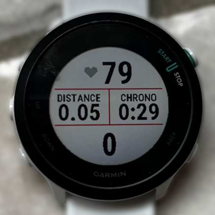
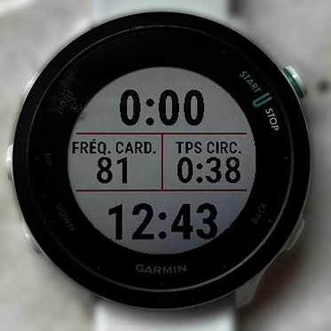
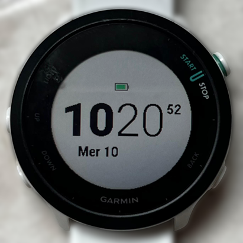

```{r setup, include=FALSE}
WORDS_TO_IGNORE <- c("apps", "Connect", "Coros", "Forerunner", "Garmin",
                     "icu", "intervals", "l'EF", "lap", "running")
source("knitr-options.R")
source("spelling-check.R")
```

# Utiliser une montre running {-}

## Pourquoi utiliser une montre running ? {-}

Une montre GPS de course n'est pas réservée aux coureurs aguerris. Même pour quelqu'un qui débute ou court occasionnellement, elle apporte rapidement des bénéfices concrets.

- **Suivre sa fréquence cardiaque** : c'est sans doute l'utilité principale. Courir "à la FC" permet de s'assurer qu'on ne part pas trop vite — une erreur très courante qui mène à la fatigue prématurée et aux blessures. Sur une sortie tranquille, rester autour de 140 bpm est bien plus parlant que d'essayer de "courir lentement".

- **Mesurer la distance et l'allure** : savoir qu'on court à 6:00 min/km plutôt que d'estimer à vue, c'est utile pour progresser de façon cohérente et préparer une course.

- **Garder une trace de ses entraînements** : les activités sont enregistrées automatiquement et synchronisées sur des apps comme Garmin Connect ou intervals.icu (cf. section dédiée dans "Suivi des licenciés"). On peut voir sa progression sur plusieurs mois, repérer un sur-entraînement, ou simplement avoir la satisfaction de voir les kilomètres s'accumuler.

- **Rester motivé** : les données objectives (FC, allure, distance) donnent des repères concrets sur sa progression — bien plus motivants que l'impression subjective d'une séance.

Pour le choix de la montre, Garmin est la marque la plus répandue au club et reste une valeur sûre. Une entrée de gamme comme la Forerunner 55 (~150€) couvre largement tous les besoins d'un coureur de club (c'est celle que j'ai, j'en suis très satisfaite et je trouve même que la FC au poignet est assez précise). On voit aussi de plus en plus d'athlètes confirmés opter pour une montre Coros.

## Les circuits (laps) {-}

Un **lap** (ou circuit) est un marqueur de temps et de distance que la montre peut déclencher de deux façons&nbsp;:

- **Automatiquement tous les kilomètres** : la montre vibre et affiche l'allure du kilomètre écoulé, ce qui donne un retour régulier sans avoir à regarder la montre en permanence. Je conseille de garder ce réglage activé (il l'est par défaut sur la plupart des Garmin).

- **Manuellement** en pressant le bouton en bas à droite : indispensable sur les fractionnés. On lape au départ d'un intervalle — le chrono (de l'écran n°2 ci-dessous) repart à zéro, l'allure moyenne se réinitialise — puis on lape à nouveau au début de la récupération pour en mesurer la durée. Les deux types de laps coexistent sans problème.

Il n'est donc pas nécessaire de stopper la montre entre l'échauffement, les fractionnés et le retour au calme : tout s'enregistre dans une seule activité, et le détail par lap est disponible sur Garmin Connect et sur intervals.icu.


## Données utiles pendant une séance {-}

Pendant une séance, deux boutons sur le côté gauche de la montre (milieu et bas) permettent de naviguer entre les écrans. Voici les trois écrans que j'utilise systématiquement&nbsp;:

<table style="table-layout: fixed; width: 100%;">
<thead>
<tr>
<th style="text-align: center; width: 33%;">Écran 1 — EF</th>
<th style="text-align: center; width: 33%;">Écran 2 — Fractionné</th>
<th style="text-align: center; width: 33%;">Écran 3 — Horloge</th>
</tr>
</thead>
<tbody>
<tr>
<td style="vertical-align: top; padding: 5px;">

</td>
<td style="vertical-align: top; padding: 5px;">

</td>
<td style="vertical-align: top; padding: 5px;">

</td>
</tr>
</tbody>
</table>

- **Écran 1 — Endurance fondamentale (EF)** : j'affiche la fréquence cardiaque en grand, le chrono total, la distance et la cadence. Idéal pour les sorties à allure modérée où le pilotage se fait avant tout à la FC (cf. sections dédiées sur l'EF et la cadence). On vérifie d'un coup d'œil qu'on reste dans la bonne zone.

- **Écran 2 — Séance fractionnée** : c'est l'écran à consulter pendant les fractionnés où j'affiche à la fois l'allure instantanée en haut (très réactive) et l'allure moyenne sur un lap en bas (plus précise après quelques dizaines de mètres). J'affiche aussi toujours la FC, ainsi que le temps écoulé sur le dernier lap (utile pour le temps de récupération notamment). 

- **Écran 3 — Horloge** : notamment pour savoir quand m'arrêter pour faire les gammes ou aller chercher ma pizza de 20h30 le jeudi.

Pour configurer ces écrans, il suffit de 

- rester appuyer sur le bouton au milieu à gauche
- aller dans "Activités et applications"
- Course à pied -> Paramètres -> Écrans de données
- Modifier la Disposition (pour avoir 4 champs par écran) puis les Champs de données un par un pour chacun des écrans

Pour plus de configuration sur la montre, regardez [cette vidéo](https://www.youtube.com/watch?v=p65qvGSK-qk).
